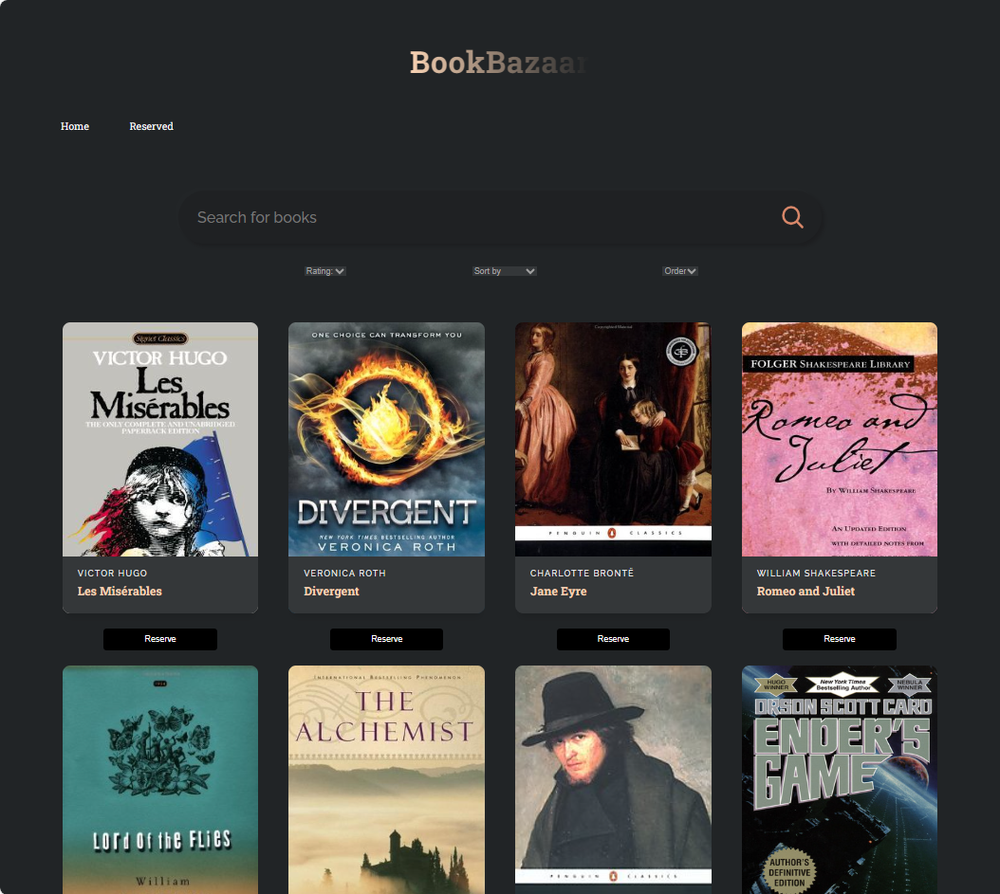
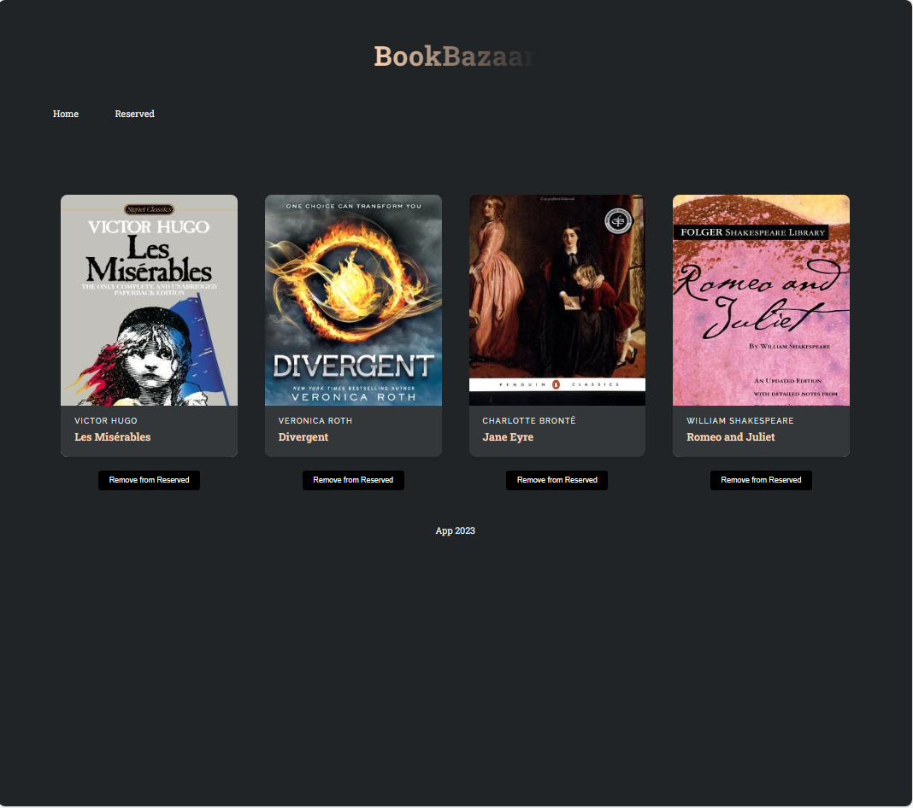
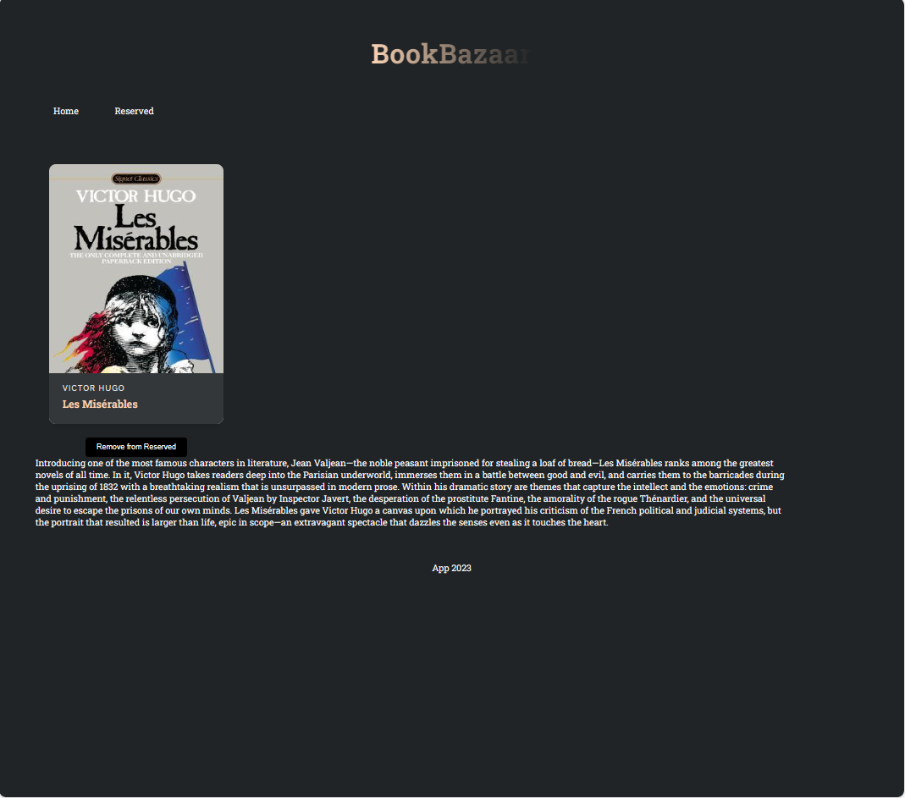

## Introduction
# Getting Started with Create React App

This project was bootstrapped with [Create React App](https://github.com/facebook/create-react-app).

## before start 
This book_app_client needs a recent version Node.js installed

To install the Node.js, you can use Node Version Manager (nvm)
https://github.com/nvm-sh/nvm

To install the latest Node.js
nvm install --lts
https://nodejs.org/en

run "node -v" to check node is installed
node -v
v18.18.0

It also need to install npm 
https://docs.npmjs.com/downloading-and-installing-node-js-and-npm

run "npm -v" to check npm is installed

## Install dependencies
before start this  mock GraphQL server, it need to install dependencies:

run follow cmd in cli:
cd book_app_client
npm i

##  start this mock GraphQL book app server first 
open a new cmd cli 
cd book_app_server
npm start

> graphql-server-book@1.0.0 start
> node index.js

ApolloServer ready at: http://127.0.0.1:4000/

## now back to book_app_client cli

In the book_app_client directory, you can run:

### `npm start`

Runs the app in the development mode.\
Open [http://localhost:3000](http://localhost:3000) to view it in your browser.

The page will reload when you make changes.\
You may also see any lint errors in the console.

