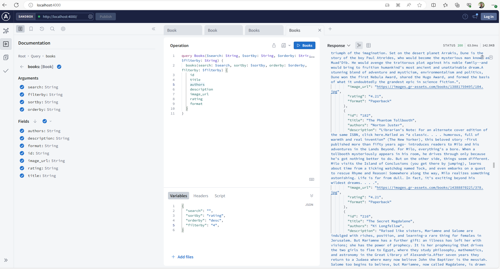

## Introduction
This book app mock GraphQL server is base on Apollo Server
https://www.apollographql.com/docs/apollo-server/

The books data sample is download from 
https://example-data.draftbit.com/books

It just for demo or development.
It allow the user using GraphQL to search, filter, sort the book data.

## before start 
This book_app_server needs a recent version Node.js installed

To install the Node.js, you can use Node Version Manager (nvm)
https://github.com/nvm-sh/nvm

To install the latest Node.js
nvm install --lts
https://nodejs.org/en

run "node -v" to check node is installed
node -v
v18.18.0

It also need to install npm 
https://docs.npmjs.com/downloading-and-installing-node-js-and-npm

run "npm -v" to check npm is installed

## Install dependencies
before start this  mock GraphQL server, it need to install dependencies:

run follow cmd in cli:
cd book_app_server
npm i

## now start this mock GraphQL server for book app
npm start

## Available Scripts

In the book_app_server directory, you can run:

`npm start`

Runs the app in the development mode.\
Open [http://localhost:4000](http://localhost:4000) to view it in your browser.

Test the GraphQL query like in the browser:
'query Books($search: String, $sortby: String, $orderby: String, $filterby: String) {
  books(search: $search, sortby: $sortby, orderby: $orderby, filterby: $filterby) {
    id
    title
    authors
    description
    image_url
    rating
    format
  }
}'

`{
  "search": "",
  "sortby": "rating",
  "orderby": "desc",
  "filterby": "4",
}`

